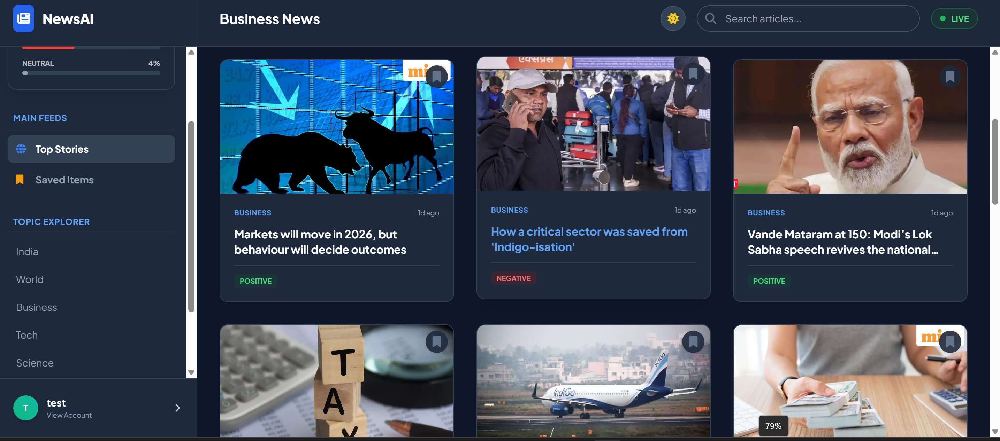

# Real-Time News Summarization Portal

A real-time news aggregation platform that crawls live RSS feeds from major news outlets, automatically summarizes articles using NLP, scores their sentiment, and serves them through a web portal — with user bookmarking and automatic content lifecycle management.

---

## What It Does

The system continuously pulls fresh articles from **14 live RSS feeds** across 7 categories — India, World, Business, Technology, Science, Sports, and Entertainment/Health — sourced from outlets including BBC, Al Jazeera, TechCrunch, The Hindu, NDTV, The Verge, and Economic Times.

For each new article, it:
1. Scrapes the full article content and extracts the top image
2. Generates an automatic summary using NLP
3. Runs sentiment analysis (Positive / Negative / Neutral) using VADER
4. Stores the processed result in MongoDB, tagged by category and source

Users can browse summarized news by category and **bookmark articles** they want to keep — bookmarked articles are protected from the automatic 24-hour cleanup that clears out old, unbookmarked news.


---

## Architecture

This is a multi-service, queue-based pipeline rather than a single script:

- **Web layer (Node.js/Express)** — serves the frontend and article data to users
- **Task queue (Celery + RabbitMQ)** — dispatches article-processing jobs asynchronously so crawling and NLP don't block each other
- **NLP engine (Python)** — scrapes each article (`newspaper3k`) and runs summarization + VADER sentiment scoring
- **Cache/broker backend (Redis)** — supports the Celery task queue
- **Database (MongoDB)** — stores processed articles, user accounts, and bookmarks
- **Containerized infrastructure (Docker Compose)** — MongoDB, RabbitMQ, and Redis all run as isolated containers for consistent local setup

### How a crawl cycle works

1. A scheduled Celery task (`crawl_news`) fires periodically
2. It first checks MongoDB for any articles currently bookmarked by users and protects them from deletion
3. It deletes unbookmarked articles older than 24 hours to keep the database fresh
4. It parses each configured RSS feed and dispatches a `process_article` task per new article link (skipping duplicates and YouTube links)
5. Each `process_article` task calls the NLP engine, which downloads the article, extracts a summary and sentiment score, and saves the result to MongoDB
6. The Node.js web server reads directly from MongoDB to serve articles to the frontend

---

## Tech Stack

**Backend / Web:** Node.js, Express
**Task Queue:** Celery, RabbitMQ (message broker)
**NLP:** Python, `newspaper3k` (article extraction + summarization), `vaderSentiment` (sentiment scoring), NLTK
**Database:** MongoDB
**Cache:** Redis
**Feed Parsing:** `feedparser`
**Infrastructure:** Docker, Docker Compose

---

## News Sources & Categories

| Category | Sources |
|---|---|
| India | Times of India, The Hindu, NDTV |
| World | BBC, Al Jazeera |
| Business | Economic Times, Mint |
| Technology | The Verge, TechCrunch |
| Science | Science Daily |
| Sports | BBC Sport, NDTV Sports |
| Entertainment / Health | Hindustan Times, Science Daily (Health) |

---

## Key Features

- Real-time RSS ingestion across multiple categories and sources
- Automatic article summarization (not just headline scraping)
- Sentiment analysis per article (Positive / Negative / Neutral, with compound score)
- Duplicate detection — articles aren't reprocessed if already in the database
- Automatic 24-hour content cleanup, with bookmark protection so saved articles are never deleted
- Asynchronous processing via Celery — crawling, scraping, and NLP run as background jobs rather than blocking the web server

---

## Running the App

This project uses Docker for its infrastructure (MongoDB, RabbitMQ, Redis) alongside a Node.js web server and Python-based Celery workers.

**1. Start infrastructure services:**
```bash
docker-compose up -d
```

**2. Install Node dependencies and start the web server:**
```bash
npm install
node server.js
```

**3. Install Python dependencies and start the Celery worker:**
```bash
pip install -r requirements.txt
celery -A worker worker --loglevel=info
```

**4. (Optional) Trigger a manual crawl:**
```bash
python force_crawl.py
```

> Note: exact setup steps may need light adjustment depending on your environment — this project was originally built without a formal requirements file, so dependencies may need to be installed as errors surface (`newspaper3k`, `vaderSentiment`, `celery`, `pymongo`, `feedparser`, `nltk`).

---

## Project Structure

```
real-time-news-summarization-portal/
├── server.js              ← Node.js/Express web server
├── worker.py               ← Celery tasks: crawling, cleanup, article dispatch
├── nlp_engine.py            ← Article scraping, summarization, sentiment analysis
├── force_crawl.py           ← Manually trigger a crawl cycle
├── reset_db.py              ← Reset/clear the MongoDB database
├── debug_db.js              ← Database debugging utility
├── docker-compose.yml       ← MongoDB, RabbitMQ, Redis container setup
├── package.json              ← Node.js dependencies
└── public/                  ← Frontend static assets
```

---

## Known Limitations / Notes

- This project was originally built as a second-year coursework project, developed iteratively without formal dependency pinning — a `requirements.txt` for the Python side isn't currently included and may need to be reconstructed
- No automated tests currently included
- Designed for local/development use; no production deployment configuration included

---
